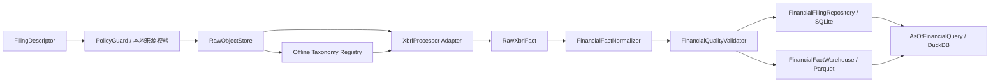

# 衡策 XBRL 财务事实内核设计

## 1. 文档控制

- 日期：2026-07-26
- 状态：设计已确认，待书面规格复核
- 分支：`codex/xbrl-financial-facts`
- 基线：`codex/market-ui-refresh`，提交 `4993733`
- 对应里程碑：M2 财务与公司行动中的第一个独立切片
- 依赖：M1 `SourcePolicy`、`PolicyGuard`、`RawObjectStore`、SQLite migration、
  Parquet/DuckDB 仓库、`RunRecord` 和证券主数据
- 上位需求：
  `docs/product/2026-07-24-a-share-long-term-research-platform-prd.md`

本设计只覆盖离线可验证的 XBRL 财务事实内核。它不假定交易所存在未验证的批量下载
接口，也不改变已经批准的数据源白名单。

## 2. 目标与成功标准

### 2.1 目标

1. 从已获准、已落入原始存储的 XBRL 实例和 taxonomy 包中提取数值型财务事实。
2. 完整保留申报、来源、原始 QName、context、unit、dimensions、版本和内容哈希。
3. 建立不可覆盖的财务申报与事实版本，支持更正和冲突。
4. 提供同时受公开时间和系统有效时间约束的当时可知查询。
5. 在 taxonomy 缺失、解析失败、映射缺失或事实冲突时安全阻断，不补猜数据。
6. 为后续 PDF 降级、财务指标派生和三个策略池提供稳定接口。

### 2.2 首切片成功标准

首切片只有同时满足以下条件才可验收：

- 一个离线 XBRL 实例可以在禁止网络访问的环境中完成解析、校验和原子发布。
- 重复导入同一原始内容不会增加申报、事实或可查询版本数量。
- 更正公开前查询只能返回旧版本；更正公开后只能返回新版本或明确阻断状态。
- 同一事实身份出现不同数值时生成冲突，不能静默选择其中一个。
- 每条可查询事实都能追溯到来源 URL、原始对象哈希、申报版本和解析器版本。
- taxonomy 缺失或引用未批准资源时任务进入 `BLOCKED`，解析器不会自行联网。
- 现有候选池仍保持阻断；本切片不会把财务数据不完整误报为策略可用。

## 3. 范围

### 3.1 包含

- `FinancialFiling`、`FinancialFact`、`FactConflict` 及内部解析类型；
- XBRL 2.1、context、unit、dimensions 和数值精度解析；
- Arelle 适配器及离线 taxonomy 注册；
- 原始 XBRL/taxonomy 文件留存和安全校验；
- 原始 QName 到标准指标的版本化映射；
- 财务事实质量校验；
- SQLite 申报清单、版本、更正、运行和冲突状态；
- 不可变 Parquet 财务事实仓库；
- DuckDB 当时可知查询；
- 单元、集成和固定回放测试。

### 3.2 不包含

- 上交所、深交所或巨潮的真实批量文件发现连接器；
- 隐藏接口、页面内部接口、验证码绕过、登录后接口或未批准域名；
- PDF/OCR/表格提取降级；
- 财务附注中的非数值叙述抽取；
- 公司行动、复权和总回报；
- ROE、ROIC、FCF、估值和策略因子计算；
- 候选池、买入指令、目标价或仓位建议；
- 新增财政部或其他来源的自动采集白名单。

真实文件发现连接器、PDF 降级和公司行动分别进入后续设计与实施切片，不与本内核
计划混合。

## 4. 核心设计决策

### XF-001：解析与网络完全解耦

解析器只接受本地原始对象引用和已登记 taxonomy 包。Arelle 必须在禁网模式运行。
任何缺失 taxonomy 都返回可诊断的阻断结果，不允许解析器跟随 schema URL 发起请求。

### XF-002：先保存原始对象，再解析

XBRL 实例、taxonomy 包和其采集溯源必须先由 `RawObjectStore` 不可变保存。解析、标准化
和质量校验只能引用已经通过内容哈希校验的原始对象。

### XF-003：只标准化数值型事实

`FinancialFact` 只接收非 nil 的数值型事实。文本、HTML、布尔值及其他非数值事实保留在
原始 XBRL 中，并计入解析诊断统计，但不进入财务事实仓库。本规则避免把叙述性披露误当
作可比较指标。

### XF-004：原始概念与标准指标分离

- `raw_qname` 保存完整 QName，是无损来源标识；
- `fact_name` 保存申报中的概念名称，不代表跨公司可比；
- `canonical_fact_name` 只在版本化映射明确命中时赋值；
- 未映射事实设置 `mapping_status=UNMAPPED` 和
  `quality_status=UNVERIFIED`，不得进入标准指标查询或策略输入。

### XF-005：使用双时态查询

- `published_at`：事实或申报首次向公众公开的时间；
- `valid_from`：该系统版本通过校验并开始可查询的时间；
- `as_of`：研究所允许使用的最晚公开时间；
- `known_at`：本次查询所允许使用的最晚系统有效时间。

查询必须显式提供 `as_of` 和 `known_at`，不得默认读取最新版本。历史补录可以使用较晚的
`known_at`，但不能突破历史 `as_of`。

### XF-006：更正不回退到已知错误旧值

当一个更正申报已经在 `as_of` 前公开，但新版本在系统中为冲突、拒绝或未验证状态时，
查询返回阻断结果，而不是继续返回已经被公开更正替代的旧值。

## 5. 架构



### 5.1 `FilingCatalog`

`FilingCatalog` 接收 `FilingDescriptor`，但首切片不负责网页发现。描述对象可以来自：

1. 测试夹具；
2. 用户明确导入的本地文件；
3. 后续获准连接器产生的公开文件描述。

本地导入仍必须提供 `source_id`、官方 `source_url`、公开时间和附件类型；它不能成为绕过
白名单的入口。

### 5.2 `TaxonomyRegistry`

`TaxonomyRegistry` 把 taxonomy 标识、入口文件、包哈希和来源信息绑定到不可变原始对象。
它只暴露本地解析路径，不暴露网络 URL 给 Arelle。一个实例引用未登记 taxonomy 时，运行
状态为 `BLOCKED`，错误码为 `FINANCIAL_TAXONOMY_MISSING`。

本切片不会新增财政部自动来源。如果交易所文件依赖未随交易所公开包提供的外部 taxonomy，
该申报保持阻断，直到形成新的来源决策记录。

### 5.3 `XbrlProcessor`

`XbrlProcessor` 是业务层唯一依赖的解析接口。初始适配器采用开源 Arelle，但业务类型不得
暴露 Arelle 对象。适配器负责：

- 加载本地实例和 taxonomy；
- 禁止外部网络访问、DTD 和外部实体；
- 把哈希校验通过的 `payload.bin` 和 taxonomy 包物化到一次性安全目录，使用清理后的原始
  文件名供 Arelle 识别，运行结束后删除该目录；
- 读取 concept、context、unit、dimensions、decimals 和值；
- 输出解析诊断和 `RawXbrlFact`；
- 记录 Arelle 及适配器版本。

Arelle 依赖必须使用兼容 Python 3.12 的上限版本约束；具体锁定版本在实施计划中通过安装
和夹具测试确定，不使用无上限依赖。

### 5.4 `FinancialFactNormalizer`

标准化层完成：

- entity、期间、维度和 unit 的规范签名；
- Decimal 数值转换；
- 币种、股份、纯数和其他单位分类；
- 原始 QName 到标准指标的版本化映射；
- 合并与母公司口径区分；
- 稳定 `fact_id`、申报内事实身份和跨申报比较身份生成。

标准映射表必须带 `mapping_version`。映射变更会生成新的派生版本，不能覆盖旧映射结果。
`mapping_status` 只允许 `MAPPED` 或 `UNMAPPED`；`consolidation_scope` 只允许
`CONSOLIDATED`、`PARENT` 或 `UNKNOWN`。`UNKNOWN` 事实为 `UNVERIFIED`。

### 5.5 `FinancialQualityValidator`

质量层只校验可证明的结构和会计关系，不估算缺失值。它输出：

- `VALID`：结构、映射和规则均通过；
- `PARTIAL`：申报可解析，但完整性不足；
- `CONFLICT`：同一身份数值冲突或版本关系冲突；
- `UNVERIFIED`：未映射或关键口径不明；
- `REJECTED`：文件或事实违反不可接受规则。

`RunStatus` 与数据质量状态分开记录。例如 taxonomy 缺失使运行 `BLOCKED`，但不会生成伪造
的 `FinancialFact`。

### 5.6 存储与查询

SQLite 保存小而事务化的状态：

- 申报清单和稳定 `filing_id`；
- 原始对象、taxonomy 和 Parquet 工件引用；
- 处理阶段、运行状态和错误码；
- 申报更正链和 `supersedes_id`；
- 冲突、质量问题和发布状态；
- `published_at`、`valid_from` 和解析版本。

Parquet 保存不可变的规范化事实。初始分区为：

```text
financial_facts/
  report_year=<YYYY>/
    report_type=<ANNUAL|Q1|HALF_YEAR|Q3>/
      exchange=<SSE|SZSE>/
        filing-<filing_id>-<content_hash>.parquet
```

每个申报产生一个内容寻址文件，便于更正、回滚和幂等校验。DuckDB 根据 SQLite 中已经发布
的工件清单查询 Parquet；目录中存在但未登记为已发布的文件不能被查询层读取。

## 6. 数据契约

### 6.1 `FilingDescriptor`

至少包含：

- `source_id`
- `source_url`
- `ts_code`
- `exchange`
- `report_period`
- `report_type`
- `published_at`
- `attachment_name`
- `content_type`
- `raw_object_hash`
- `taxonomy_refs`
- `discovery_method`

`discovery_method` 首切片只允许 `FIXTURE` 或 `MANUAL_IMPORT`。

### 6.2 `FinancialFiling`

至少包含：

- `filing_id`
- `ts_code`
- `exchange`
- `report_period`
- `report_type`
- `announcement_at`
- `published_at`
- `source_id`
- `source_url`
- `raw_object_hash`
- `taxonomy`
- `taxonomy_hashes`
- `filing_version`
- `is_restated`
- `supersedes_id`
- `parser_name`
- `parser_version`
- `mapping_version`
- `quality_status`
- `valid_from`

对财务申报，`announcement_at` 必须等于 `published_at`。保留两个字段是为了兼容上位 PRD，
查询和版本判断统一使用 `published_at`。`filing_id` 由 `source_id`、`ts_code`、
`report_period`、`report_type` 和 `raw_object_hash` 的规范序列计算，因此同一原件重复导入
得到相同 ID，而更正原件得到新 ID。

### 6.3 `FinancialFact`

在上位 PRD 字段基础上增加：

- `fact_id`
- `raw_qname`
- `canonical_fact_name`
- `mapping_status`
- `context_signature`
- `entity_identifier`
- `period_start`
- `period_end`
- `instant`
- `unit_signature`
- `decimals`
- `consolidation_scope`
- `dimensions`
- `fact_identity_hash`
- `comparison_identity_hash`

约束：

- 为兼容现有 `FactBase`，`record_id` 必须等于 `fact_id`；
- 期间型事实必须设置 `period_start` 和 `period_end`，不得设置 `instant`；
- 时点型事实必须设置 `instant`，不得设置期间起止；
- `fact_value` 使用 Decimal 的无损文本表示，不经过二进制浮点转换；
- `currency` 只对货币事实设置；
- `canonical_fact_name` 在 `UNMAPPED` 时必须为空；
- `announcement_at == published_at`；
- `effective_at` 固定为报告期结束日 23:59:59，Asia/Shanghai；
- `published_at`、`collected_at` 和 `valid_from` 必须是带时区时间；
- `version` 是由申报版本、解析器版本和映射版本共同确定的不可变系统事实版本；
- `filing_id` 必须引用已经保存的 `FinancialFiling`；
- `content_hash` 必须能解析到 `RawObjectStore` 中的实例文件；
- 更正申报中能够一一匹配的事实使用 `supersedes_id` 指向旧事实；不能一一匹配时只保留
  申报级更正链，并阻断受影响标准指标。

### 6.4 事实身份

同一申报内的事实身份由以下字段的规范序列计算 SHA-256：

```text
filing_id
raw_qname
entity_identifier
period_start | period_end | instant
unit_signature
dimensions
```

`context_id` 不参与稳定身份，因为它只在单个 XML 文档内有意义。dimensions 按完整 QName
排序后规范编码。相同身份和相同数值为重复；相同身份和不同数值为 `FactConflict`。

跨更正申报的比较身份 `comparison_identity_hash` 使用相同字段，但排除 `filing_id`，并增加
`report_period`、`report_type` 和 `consolidation_scope`。它只用于建立事实级
`supersedes_id` 和判断受影响指标，不能替代申报内唯一键。映射版本变化时，比较仍以
`raw_qname` 为基础，避免新映射错误连接两个不同来源概念。

### 6.5 `FactConflict`

至少包含：

- `conflict_id`
- `filing_id`
- `fact_identity_hash`
- `competing_fact_ids`
- `conflict_type`
- `detected_at`
- `quality_status=CONFLICT`
- `resolution_status`

首切片不提供人工择值功能，`resolution_status` 只能是 `OPEN` 或由完整更正申报形成
`SUPERSEDED`。

## 7. 数据流与原子发布

1. 校验 `FilingDescriptor` 的来源、URL、用途和附件类型。
2. 校验原始对象哈希；若是网络连接器产生的描述，连接器必须先通过 `PolicyGuard`。
3. 安全展开获准 ZIP，拒绝路径穿越、符号链接、超出大小上限和异常压缩比。
4. 在 `TaxonomyRegistry` 中解析所有 schema 引用；缺失时停止。
5. Arelle 离线解析并产生诊断与 `RawXbrlFact`。
6. 标准化数值事实并运行结构、范围、关系和冲突校验。
7. SQLite 创建待发布申报版本和预期工件身份。
8. Parquet 写入临时文件，完成内容哈希、行数和 schema 校验。
9. 以不可覆盖方式发布 Parquet 文件。
10. SQLite 原子登记工件并把申报版本转为可查询状态。
11. 查询层只读取 SQLite 发布清单中的工件。

步骤 7 至 10 任一步失败都不能产生部分可见申报。重跑相同原始哈希时复用已经校验的原始
对象和最终工件。

## 8. 当时可知与更正语义

查询接口概念形式：

```text
query_financial_facts(
    ts_code,
    report_period,
    canonical_fact_names,
    as_of,
    known_at,
)
```

可返回事实必须同时满足：

1. `published_at <= as_of`；
2. `valid_from <= known_at`；
3. 申报工件已经原子发布；
4. 质量状态满足调用方要求；
5. 在 `as_of` 和 `known_at` 下不存在已经公开且系统已知的有效替代版本。

如果一个替代申报已公开但质量未通过，则相关事实返回阻断原因
`FINANCIAL_RESTATEMENT_UNUSABLE`。查询不得回退到被公开更正的旧值。

最新研究页也必须显式传入当前 `as_of` 和 `known_at`；“当前”由调用方计算，仓库接口没有
隐式 `now()` 默认值。

## 9. 质量规则

### 9.1 结构规则

- entity identifier 必须能映射到描述对象中的 `ts_code`；
- 报告期间不得晚于 `published_at`；
- context 必须且只能表达期间型或时点型之一；
- numeric fact 必须有可解析 unit；
- nil、NaN、Infinity 和非法 Decimal 被拒绝；
- dimensions 的 QName 和成员必须完整；
- 合并口径与母公司口径不能合并去重。

### 9.2 数值与单位规则

- 货币事实保留原始币种，不自动换算；
- 股份、每股、百分比和纯数单位分别编码；
- `decimals` 和 scale 按 XBRL 语义应用一次，不能重复缩放；
- 分母为零的派生指标不在本切片计算；
- 同一标准指标存在不同单位时保持独立事实，不能自动择一。

### 9.3 会计关系规则

资产负债表恒等检查只在所需组件、期间、单位、币种和合并口径一致时执行。容差由相关事实
的 `decimals` 推导，不能使用固定人民币金额。组件缺失返回 `PARTIAL`，恒等关系超出容差
返回 `CONFLICT`。

首切片不以 PDF 作为正确性裁决来源，也不把“XBRL 可解析”解释为“财务数据完整”。

## 10. 安全与合规

- XML 禁止 DTD、外部实体和解析时网络访问；
- ZIP 展开限制文件数量、单文件大小、总大小、压缩比和目标路径；
- 只接受政策允许的 XBRL/XML/ZIP 内容类型和扩展名组合；
- 内容类型与文件签名不一致时拒绝；
- 日志不得包含 Token、整份附件或大量财务正文；
- `source_url`、内容哈希、采集时间、解析器版本和质量状态必须可审计；
- 非白名单或未批准附件在请求前拒绝并写入 `RefusalRecord`；
- 测试公司和数值必须明确标注为固定夹具，不能进入生产数据目录。

## 11. 错误处理

| 情形 | 运行或查询状态 | 数据质量/结果 | 错误码 |
| --- | --- | --- | --- |
| 非白名单或用途不允许 | `BLOCKED` | 不请求、不解析 | `POLICY_DENIED` |
| 原始哈希不一致 | `FAILED` | `REJECTED` | `RAW_PAYLOAD_INTEGRITY_ERROR` |
| taxonomy 缺失 | `BLOCKED` | 不生成事实 | `FINANCIAL_TAXONOMY_MISSING` |
| XML/XBRL 解析失败 | `FAILED` | `REJECTED` | `FINANCIAL_XBRL_PARSE_ERROR` |
| 无数值事实 | `PARTIAL` | `PARTIAL` | `FINANCIAL_NUMERIC_FACTS_MISSING` |
| 概念未映射 | `PARTIAL` | `UNVERIFIED` | `FINANCIAL_FACT_UNMAPPED` |
| 同一身份数值冲突 | `PARTIAL` | `CONFLICT` | `FINANCIAL_FACT_CONFLICT` |
| 更正版本不可用 | 查询阻断 | 不回退旧值 | `FINANCIAL_RESTATEMENT_UNUSABLE` |
| Parquet 工件校验失败 | `FAILED` | 不发布 | `FINANCIAL_PARQUET_INTEGRITY_ERROR` |

错误摘要只陈述事实和定位信息，不包含未经验证的修复猜测。

## 12. 测试设计

### 12.1 固定夹具

测试夹具使用虚构发行人和明确的测试代码，至少包括：

1. 正常期间型与时点型数值事实；
2. 合并和母公司两个 context；
3. 维度成员事实；
4. CNY、shares、per-share 和 pure 单位；
5. 有限 decimals 和无限精度；
6. 相同内容重复导入；
7. 更正申报及 `supersedes_id`；
8. 相同身份不同数值；
9. 未映射 QName；
10. taxonomy 缺失和禁止的远程 schema 引用；
11. 未来公开时间；
12. 恶意 XML 和 ZIP 路径穿越。

### 12.2 单元测试

- Pydantic 契约和字段互斥；
- context、unit、dimensions 规范签名；
- Decimal、scale 和 decimals；
- 事实身份与幂等；
- QName 映射版本；
- 会计恒等容差；
- 更正链和冲突；
- `as_of`/`known_at` 双时态筛选；
- ZIP/XML 安全拒绝；
- Arelle 适配器禁网。

### 12.3 集成测试

- `RawObjectStore → Arelle → Normalizer → Validator → Parquet → SQLite` 全链路；
- 相同申报重跑两次；
- Parquet 写入后、SQLite 发布前的崩溃恢复；
- SQLite 预登记后、Parquet 发布前的崩溃恢复；
- 更正公开前后固定回放；
- taxonomy 缺失阻断；
- 事实冲突阻断；
- 未登记 Parquet 文件对查询不可见。

### 12.4 验收测试

- AC-XF01：解析过程发起任何网络请求时测试立即失败。
- AC-XF02：每条可查询事实可回溯到原始对象哈希和官方来源 URL。
- AC-XF03：同一申报导入两次后事实和发布版本数量不增加。
- AC-XF04：更正公开前只能读取旧值，公开后读取新值或明确阻断。
- AC-XF05：冲突事实不能出现在标准指标查询结果中。
- AC-XF06：缺失 taxonomy 时不生成部分财务事实。
- AC-XF07：工件或 SQLite 发布任一步失败时，不产生部分可见申报。
- AC-XF08：未映射事实保留原始 QName，但不能进入标准指标查询。
- AC-XF09：现有 189 项 M1 测试继续通过。
- AC-XF10：没有真实财务事实进入测试夹具、Git 或演示数据域。

## 13. 可观测性与运行记录

每次导入至少记录：

- 运行 ID、申报 ID、来源和原始哈希；
- taxonomy 包哈希；
- 解析器、适配器和映射版本；
- 原始事实数、数值事实数、映射数、未映射数、冲突数和发布数；
- 处理阶段状态、错误码和耗时；
- Parquet 路径、行数和内容哈希；
- `published_at`、`collected_at`、`valid_from`。

统计只来自实际处理结果，不使用推测值或演示值。

## 14. 实施边界与后续切片

本设计完成后，实施计划按以下依赖顺序拆分任务：

1. 契约和状态；
2. taxonomy 注册与安全文件处理；
3. Arelle 离线适配器；
4. 标准化和映射；
5. 质量校验；
6. SQLite 版本仓库；
7. Parquet 仓库；
8. 双时态查询；
9. 全链路与固定回放验收；
10. 运行文档。

首切片验收后再分别设计：

- 公开 XBRL 文件发现连接器；
- 巨潮 PDF 降级和 XBRL/PDF 冲突；
- 公司行动、复权和总回报；
- 财务派生指标和策略输入门槛。

这些后续切片不得反向放宽本设计的禁网解析、不可变原始数据、双时态查询或冲突阻断原则。
